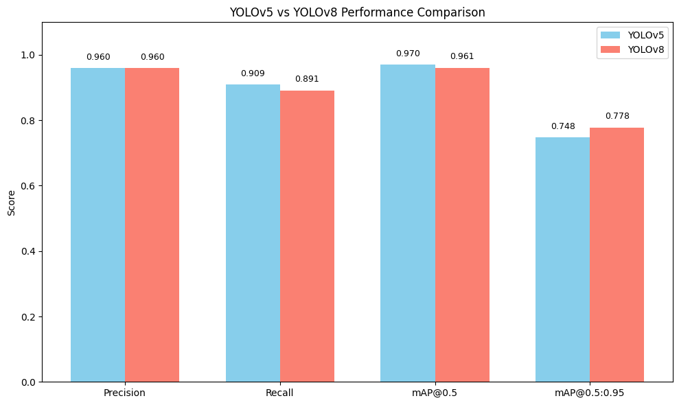

# Do Newer Models Always Win? A YOLOv5 vs YOLOv8 Comparison

**🚦 Comparison of YOLOv5 and YOLOv8 on Traffic Sign Detection**  
  
This project aims to compare the performance of YOLOv5 and YOLOv8 on a traffic sign detection task. It demonstrates that newer models don't always guarantee better results, emphasizing the importance of dataset characteristics and appropriate model selection.

**📁 Dataset**  
  
• Traffic Signs Dataset in YOLO format  
• Number of classes: 4  (prohibitory, danger, mandatory, other)  
• Images with corresponding YOLO-format .txt label files 

**🧠 Models Compared**  

- YOLOv5s (small variant)
- YOLOv8n (nano variant)

